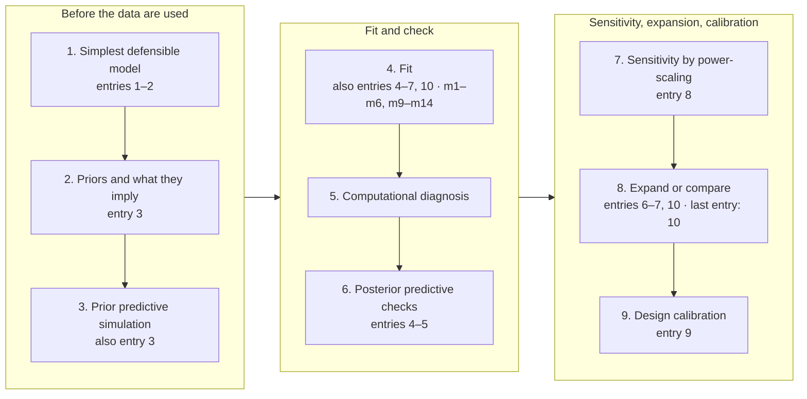

# Workflow record – pest-control trial

Generated 2026-09-03 12:51 from `bayes-workflow-log.md` (11 entries, all dated 2026-09-02) and the files in `with_plugin_current/`: 16 scripts, 22 files in `output/`, 11 in `figures/`, 37 in `model-data/`. This file is rewritten from the log by `bw_scheme.R`; changes made here do not survive regeneration.

## Where the analysis stands

- Last entry: 2026-09-02 – The report, and the check on it (outside the loop: write-up).
- Last entry inside the loop: 2026-09-02 – m14: the building-type question, tested rather than argued (stage 8, entry 10).
- The last entry has no line marked "Next". It ends: "Reading the number-free quantified claims against the tables behind them is what caught the building-type error above. That is the pass which is worth its cost."
- Model the log last describes as carried forward, best or reported: m9 – "m9 (zero inflation with predictors AND the interaction) is the best model by ten-fold cross-validation, with m11 (its hurdle twin) 1.5 elpd behind on a standard error of 2.4 – indistinguishable." (entry 7).
- Models named in the log: m1–m6, m9–m14 (12). Fit files on disk for m1–m14. On disk but not in the log: m7–m8.

## The loop as the log walked it

Each node names the entries placed at that stage; "also" marks entries placed elsewhere whose text reaches the stage. Step 10, the return to step 1, is read from the passes table: an entry placed at an earlier stage than the entry before it. Entries outside the loop (the write-up) are in the passes table.

## Stages

| Stage | Entries placed here | Also reached by | Files placed here |
|---|---|---|---|
| 1 Simplest defensible model | 1 – Before any fit: the estimand, the structure, the abandonment rule; 2 – Data description | – | `01_explore.R`, `07_estimand.R`, `output/01_explore.txt`, `output/07_estimand.txt`, `output/07_estimand_by_tertile.csv`, `output/07_estimand_table.csv`, `figures/fig_effect_by_baseline.png`, `figures/fig_estimand.png`, `figures/fig_explore.png` |
| 2 Priors and what they imply | 3 – Priors, chosen by what they imply | – | model-data: 3 files |
| 3 Prior predictive simulation | – | 3 | `02_prior_check.R`, `output/02_prior_check.txt`, `figures/fig_prior_predictive.png` |
| 4 Fit | – | 4–7, 10 | `03_fit.R`, `14_senior_interaction.R`, `output/03_fit.txt`, `output/14_senior_interaction.txt`; model-data: 18 files |
| 5 Computational diagnosis | – | – | `04_diagnose_ppc.R`, `10_diagnose_later.R`, `output/04_diagnose_ppc.txt`, `output/10_diagnose_later.txt` |
| 6 Posterior predictive checks | 4 – m1 Poisson: the failure that names the next model; 5 – m2 negative binomial: dispersion fixed, the contrast wrong | – | `04_diagnose_ppc.R`, `output/04_diagnose_ppc.txt`, `output/04_ppc_table.csv`, `output/07b_ppc_table.csv`, `figures/fig_ppc_arm_means.png`, `figures/fig_ppc_density.png`, `figures/fig_ppc_m1_pois.png`, `figures/fig_ppc_m2_nb.png`, `figures/fig_ppc_m4_hnb.png`, `figures/fig_ppc_m6_nb_int.png` |
| 7 Sensitivity by power-scaling | 8 – Sensitivity | – | `08_sensitivity.R`, `output/08_prior_variants.csv`, `output/08_sensitivity.txt`, `figures/fig_sensitivity.png` |
| 8 Expand or compare | 6 – m3 to m6: separating the two candidate repairs; 7 – m9 to m13: the combinations, and the checks the interaction has to survive; 10 – m14: the building-type question, tested rather than argued | – | `05_compare.R`, `06_extra.R`, `output/05_compare.txt`, `output/06_extra.txt`; model-data: 22 files |
| 9 Design calibration | 9 – Design calibration | – | `09_calibration.R`, `output/09_calibration.txt` |
| Write-up | 11 – The report, and the check on it | – | `11_check_numbers.R`, `12_report_numbers.R`, `output/11_check_numbers.txt`, `output/12_report_numbers.txt` |

## Passes in the order logged

| # | Date | Entry | Stage | Also | Placed by | Models first named | Files named | Next, as written |
|---:|---|---|---|---|---|---|---|---|
| 1 | 2026-09-02 | Before any fit: the estimand, the structure, the abandonment rule | 1 | – | heading wording, before the first fit | – | – | – |
| 2 | 2026-09-02 | Data description | 1 | – | heading wording, before the first fit | – | – | – |
| 3 | 2026-09-02 | Priors, chosen by what they imply | 2 | 3 | heading wording | – | – | – |
| 4 | 2026-09-02 | m1 Poisson: the failure that names the next model | 6 | 4 | body wording | m1 | – | negative binomial. |
| 5 | 2026-09-02 | m2 negative binomial: dispersion fixed, the contrast wrong | 6 | 4 | body wording | m2 | – | – |
| 6 | 2026-09-02 | m3 to m6: separating the two candidate repairs | 8 | 4 | body wording | m3–m6 | – | – |
| 7 | 2026-09-02 | m9 to m13: the combinations, and the checks the interaction has to survive | 8 | 4 | body wording | m9–m13 | – | – |
| 8 | 2026-09-02 | Sensitivity | 7 | – | heading wording | – | – | – |
| 9 | 2026-09-02 | Design calibration | 9 | – | heading wording | – | – | – |
| 10 | 2026-09-02 | m14: the building-type question, tested rather than argued | 8 | 4 | body wording | m14 | – | – |
| 11 | 2026-09-02 | The report, and the check on it | write-up | – | heading wording | – | `12_report_numbers.R` | – |

## Models

| Model | Files with this id in the name | First entry | Last entry | What the log says of it |
|---|---|---|---|---|
| m1 | `m1_pois.rds`, `kfold_m1_pois.rds`, `fig_ppc_m1_pois.png` | 4 | 4 | – |
| m2 | `m2_nb.rds`, `kfold_m2_nb.rds`, `fig_ppc_m2_nb.png` | 5 | 7 | – |
| m3 | `m3_zinb.rds`, `kfold_m3_zinb.rds` | 6 | 6 | indistinguishable (entry 6) |
| m4 | `m4_hnb.rds`, `kfold_m4_hnb.rds`, `fig_ppc_m4_hnb.png` | 6 | 6 | – |
| m5 | `m5_zinb_x.rds`, `kfold_m5_zinb_x.rds` | 6 | 6 | – |
| m6 | `m6_nb_int.rds`, `kfold_m6_nb_int.rds`, `fig_ppc_m6_nb_int.png` | 6 | 6 | – |
| m7 | `m7_nb_bare.rds`, `kfold_m7_nb_bare.rds` | not in the log | not in the log | – |
| m8 | `m8_nb_spline.rds`, `kfold_m8_nb_spline.rds` | not in the log | not in the log | – |
| m9 | `m9_prior_reported.rds`, `m9_prior_tight.rds`, `m9_prior_tight_vetted.rds`, `m9_prior_wide.rds`, `m9_zinb_full.rds`, `kfold_m9_zinb_full.rds` | 7 | 10 | best model (entry 7) |
| m10 | `m10_hnb_x.rds`, `kfold_m10_hnb_x.rds` | 7 | 7 | – |
| m11 | `m11_hnb_full.rds`, `kfold_m11_hnb_full.rds` | 7 | 8 | indistinguishable (entry 7) |
| m12 | `m12_nb_bysmooth.rds`, `kfold_m12_nb_bysmooth.rds` | 7 | 7 | – |
| m13 | `m13_nb_freeexp.rds`, `kfold_m13_nb_freeexp.rds` | 7 | 7 | the offset stands (entry 7) |
| m14 | `m14_zinb_senior.rds`, `kfold_m14_zinb_senior.rds` | 10 | 10 | – |

## Reproducibility record

- Data files: `data/codebook.md`, `data/pest_trial.csv`.
- Helper scripts (sourced by others): `00_data.R`.
- Seed calls found in the scripts: `set.seed(20260902)`, `set.seed(SEED)`.

Evidence for each placement

**Entry 1 – Before any fit: the estimand, the structure, the abandonment rule.** Placed at 1 by heading wording (before any fit, estimand); the entry precedes the first fit, so its body was not scanned. Opens: "Did the treatment reduce the number of pests caught, and by how much?" Ends: "(a) A posterior predictive check on the proportion of zeros or on dispersion that the model cannot reproduce; (b) p_loo far above the parameter count, which for counts means the family is wrong; (c) power-scaling showing the treatment contrast moves with the prior; (d) the answer changing materially between the adjusted and unadjusted specifications, which would mean the covariates are doing identification work that randomisation was supposed to do."

**Entry 2 – Data description.** Placed at 1 by heading wording (data description); the entry precedes the first fit, so its body was not scanned. Opens: "caught: mean 25.7, variance 2585, variance-to-mean ratio 101." Ends: "Crude, unadjusted, ignoring the exposure window: treated apartments caught 20.1 pests per standard window on average against 36.0 untreated, a rate ratio of 0.56."

**Entry 3 – Priors, chosen by what they imply.** Placed at 2 by heading wording (priors); body words for 2: normal(, gamma(, exponential(, beta( (8 hits). Also 3: prior sets simulated, sample_prior. Opens: "Three prior sets simulated with sample_prior = "only" and compared on the observable scale." Ends: "The prior brackets the data without asserting the answer."

**Entry 4 – m1 Poisson: the failure that names the next model.** Placed at 6 by body wording (predicted proportion, posterior predictive). Also 4: m1 first named here. Below the two hits a stage needs: 8 (p_loo). Opens: "p_loo 264.1 against four parameters." Ends: "Next: negative binomial."

**Entry 5 – m2 negative binomial: dispersion fixed, the contrast wrong.** Placed at 6 by body wording (zero proportion, reproduces). Also 4: m2 first named here. Below the two hits a stage needs: 1 (the question). Opens: "The zero proportion and the dispersion now pass." Ends: "Two candidate causes, and both were fitted: the 36% zeros are not being generated by the right process, and the effect may not be constant across levels of infestation."

**Entry 6 – m3 to m6: separating the two candidate repairs.** Placed at 8 by body wording (indistinguishable, elpd, elpd). Also 4: m3–m6 first named here. Below the two hits a stage needs: 6 (zero proportion). Opens: "m3 (zero-inflated, constant zi) estimates zi at 0.05 and is indistinguishable from m2." Ends: "So both repairs are real and neither excludes the other."

**Entry 7 – m9 to m13: the combinations, and the checks the interaction has to survive.** Placed at 8 by body wording (cross-validation, elpd, behind, indistinguishable). Also 4: m9–m13 first named here. Below the two hits a stage needs: 6 (reproduces). Opens: "m9 (zero inflation with predictors AND the interaction) is the best model by ten-fold cross-validation, with m11 (its hurdle twin) 1.5 elpd behind on a standard error of 2.4 – indistinguishable." Ends: "The interaction is what reconciles the model with the contrast the randomisation delivers."

**Entry 8 – Sensitivity.** Placed at 7 by heading wording (sensitivity); body words for 7: power-scaling, sensitivity, prior-data conflict (5 hits). Below the two hits a stage needs: 3 (prior predictive). Opens: "Power-scaling the reported quantity rather than the coefficients: prior sensitivity 0.017 under m9 and 0.020 under m11, both well under the 0.05 threshold, against likelihood sensitivity 0.135 and 0.118." Ends: "The reported quantity does not move with it, which is the reason for power-scaling the quantity rather than the parameters."

**Entry 9 – Design calibration.** Placed at 9 by heading wording (calibration); body words for 9: trials simulated, recovered, sign errors, exaggeration, sign-error, recovers (8 hits). Opens: "One hundred trials simulated at n = 262 with the covariate mix, arm sizes and trapping windows resampled from the trial." Ends: "The estimated effect sits in the range this design recovers reliably; the upper end of its interval sits in the range it does not, which is why that interval reaches almost to 1."

**Entry 10 – m14: the building-type question, tested rather than argued.** Placed at 8 by body wording (adds the term, elpd, behind). Also 4: m14 first named here. Opens: "Writing up the subgroup results showed that the averaged effect ratio in senior-only buildings (0.53) differs from the ratio elsewhere (0.60) with a ratio of ratios of 0.87 [0.79, 0.95], even though the model carries no treatment-by-building-type term." Ends: "The first draft of the report said there was "no evidence that the treatment works differently in the two settings", which was wrong on its own numbers; this entry records the correction."

**Entry 11 – The report, and the check on it.** Placed outside the loop (write-up) by heading wording (report); the body of a write-up entry is not scanned. Opens: "br_check_numbers() traced all 333 numbers in REPORT.md to a value in output/." Ends: "That is the pass which is worth its cost."

Files on disk (86)

Scripts

| Script | Stage | Stage by | Banner title | Declared output | Named in entries |
|---|---|---|---|---|---|
| `00_data.R` | helper | banner purpose (sourced by) | Pest trial - shared analysis frame | – | – |
| `01_explore.R` | 1 | file name | Pest trial - data description and design check | output/01_explore.txt, figures/fig_explore.png | – |
| `02_prior_check.R` | 3 | file name | Prior predictive check for the pest-trial count model | output/02_prior_check.txt, figures/fig_prior_predictive.png | – |
| `03_fit.R` | 4 | file name | Pest trial - the model sequence | model-data/*.rds, output/03_fit.txt | – |
| `04_diagnose_ppc.R` | 5, 6 | file name | Pest trial - computational diagnosis and posterior predictive checks | output/04_diagnose_ppc.txt, figures/fig_ppc_*.png | – |
| `05_compare.R` | 8 | file name | Pest trial - model comparison by cross-validation | output/05_compare.txt, model-data/kfold_*.rds | – |
| `06_extra.R` | 8 | file name | Pest trial - two models the earlier checks asked for | model-data/m9*.rds, model-data/m10*.rds, output/06_extra.txt | – |
| `07_estimand.R` | 1 | file name | Pest trial - the answer, as a quantity rather than a coefficient | output/07_estimand.txt, output/07_estimand_table.csv, figures/fig_estimand.png, figures/fig_effect_by_baseline.png | – |
| `07b_checks_and_secondary.R` | – | no match | Pest trial - checks on the later models, and the quantities a building manager would ask for | output/07b_checks_secondary.txt, figures/fig_ppc_arm_means.png | – |
| `08_sensitivity.R` | 7 | file name | Pest trial - is the answer the data's or the prior's? | output/08_sensitivity.txt, figures/fig_sensitivity.png | – |
| `09_calibration.R` | 9 | file name | Pest trial - what this design can and cannot detect | output/09_calibration.txt | – |
| `10_diagnose_later.R` | 5 | file name | Pest trial - computational diagnosis for the later models | output/10_diagnose_later.txt | – |
| `11_check_numbers.R` | write-up | file name | Pest trial - trace every number in REPORT.md back to saved output | output/11_check_numbers.txt | – |
| `12_report_numbers.R` | write-up | file name | Pest trial - the numbers the report quotes, in plain decimal | output/12_report_numbers.txt | 11 |
| `13_senior_contrast.R` | – | no match | Pest trial - does the effect differ by building type? | output/13_senior_contrast.txt | – |
| `14_senior_interaction.R` | 4 | banner title | Pest trial - a treatment by building-type term, fitted rather than argued about | output/14_senior_interaction.txt | – |

Output, figures and model files

| File | Script | Stage | Stage by | Entries |
|---|---|---|---|---|
| `output/01_explore.txt` | 01_explore.R (banner) | 1 | script | – |
| `output/02_prior_check.txt` | 02_prior_check.R (banner) | 3 | script | – |
| `output/03_fit.txt` | 03_fit.R (banner) | 4 | script | – |
| `output/04_diagnose_ppc.txt` | 04_diagnose_ppc.R (banner) | 5, 6 | script | – |
| `output/04_ppc_table.csv` | 04_diagnose_ppc.R (prefix) | 6 | script and file name | – |
| `output/05_compare.txt` | 05_compare.R (banner) | 8 | script | – |
| `output/06_extra.txt` | 06_extra.R (banner) | 8 | script | – |
| `output/07_estimand.txt` | 07_estimand.R (banner) | 1 | script | – |
| `output/07_estimand_by_tertile.csv` | 07_estimand.R (prefix) | 1 | script | – |
| `output/07_estimand_table.csv` | 07_estimand.R (banner) | 1 | script | – |
| `output/07b_checks_secondary.txt` | 07b_checks_and_secondary.R (banner) | – | no match | – |
| `output/07b_ppc_table.csv` | 07b_checks_and_secondary.R (prefix) | 6 | file name | – |
| `output/07b_secondary.csv` | 07b_checks_and_secondary.R (prefix) | – | no match | – |
| `output/07b_typical.csv` | 07b_checks_and_secondary.R (prefix) | – | no match | – |
| `output/08_prior_variants.csv` | 08_sensitivity.R (prefix) | 7 | script | – |
| `output/08_sensitivity.txt` | 08_sensitivity.R (banner) | 7 | script | – |
| `output/09_calibration.txt` | 09_calibration.R (banner) | 9 | script | – |
| `output/10_diagnose_later.txt` | 10_diagnose_later.R (banner) | 5 | script | – |
| `output/11_check_numbers.txt` | 11_check_numbers.R (banner) | write-up | script | – |
| `output/12_report_numbers.txt` | 12_report_numbers.R (banner) | write-up | script | – |
| `output/13_senior_contrast.txt` | 13_senior_contrast.R (banner) | – | no match | – |
| `output/14_senior_interaction.txt` | 14_senior_interaction.R (banner) | 4 | script | – |
| `figures/fig_effect_by_baseline.png` | 07_estimand.R (banner) | 1 | script | – |
| `figures/fig_estimand.png` | 07_estimand.R (banner) | 1 | script | – |
| `figures/fig_explore.png` | 01_explore.R (banner) | 1 | script | – |
| `figures/fig_ppc_arm_means.png` | 07b_checks_and_secondary.R (banner) | 6 | file name | – |
| `figures/fig_ppc_density.png` | 04_diagnose_ppc.R (banner) | 6 | script and file name | – |
| `figures/fig_ppc_m1_pois.png` | 04_diagnose_ppc.R (banner) | 6 | script and file name | 4 (m1) |
| `figures/fig_ppc_m2_nb.png` | 04_diagnose_ppc.R (banner) | 6 | script and file name | 5 (m2) |
| `figures/fig_ppc_m4_hnb.png` | 04_diagnose_ppc.R (banner) | 6 | script and file name | 6 (m4) |
| `figures/fig_ppc_m6_nb_int.png` | 04_diagnose_ppc.R (banner) | 6 | script and file name | 6 (m6) |
| `figures/fig_prior_predictive.png` | 02_prior_check.R (banner) | 3 | script | – |
| `figures/fig_sensitivity.png` | 08_sensitivity.R (banner) | 7 | script | – |
| `model-data/kfold_folds.rds` | 05_compare.R (banner) | 8 | script | – |
| `model-data/kfold_m1_pois.rds` | 05_compare.R (banner) | 8 | script | 4 (m1) |
| `model-data/kfold_m2_nb.rds` | 05_compare.R (banner) | 8 | script | 5 (m2) |
| `model-data/kfold_m3_zinb.rds` | 05_compare.R (banner) | 8 | script | 6 (m3) |
| `model-data/kfold_m4_hnb.rds` | 05_compare.R (banner) | 8 | script | 6 (m4) |
| `model-data/kfold_m5_zinb_x.rds` | 05_compare.R (banner) | 8 | script | 6 (m5) |
| `model-data/kfold_m6_nb_int.rds` | 05_compare.R (banner) | 8 | script | 6 (m6) |
| `model-data/kfold_m7_nb_bare.rds` | 05_compare.R (banner) | 8 | script | – |
| `model-data/kfold_m8_nb_spline.rds` | 05_compare.R (banner) | 8 | script | – |
| `model-data/kfold_m9_zinb_full.rds` | 05_compare.R (banner) | 8 | script | 7 (m9) |
| `model-data/kfold_m10_hnb_x.rds` | 05_compare.R (banner) | 8 | script | 7 (m10) |
| `model-data/kfold_m11_hnb_full.rds` | 05_compare.R (banner) | 8 | script | 7 (m11) |
| `model-data/kfold_m12_nb_bysmooth.rds` | 05_compare.R (banner) | 8 | script | 7 (m12) |
| `model-data/kfold_m13_nb_freeexp.rds` | 05_compare.R (banner) | 8 | script | 7 (m13) |
| `model-data/kfold_m14_zinb_senior.rds` | 05_compare.R (banner) | 8 | script | 10 (m14) |
| `model-data/kfolds_all.rds` | – | 8 | file name | – |
| `model-data/m1_pois.rds` | – | 4 | fit file | 4 (m1) |
| `model-data/m2_nb.rds` | – | 4 | fit file | 5 (m2) |
| `model-data/m3_zinb.rds` | – | 4 | fit file | 6 (m3) |
| `model-data/m4_hnb.rds` | – | 4 | fit file | 6 (m4) |
| `model-data/m5_zinb_x.rds` | – | 4 | fit file | 6 (m5) |
| `model-data/m6_nb_int.rds` | – | 4 | fit file | 6 (m6) |
| `model-data/m7_nb_bare.rds` | – | 4 | fit file | – |
| `model-data/m8_nb_spline.rds` | – | 4 | fit file | – |
| `model-data/m9_prior_reported.rds` | 06_extra.R (banner) | 4, 8 | fit file and script | 7 (m9) |
| `model-data/m9_prior_tight.rds` | 06_extra.R (banner) | 4, 8 | fit file and script | 7 (m9) |
| `model-data/m9_prior_tight_vetted.rds` | 06_extra.R (banner) | 4, 8 | fit file and script | 7 (m9) |
| `model-data/m9_prior_wide.rds` | 06_extra.R (banner) | 4, 8 | fit file and script | 7 (m9) |
| `model-data/m9_zinb_full.rds` | 06_extra.R (banner) | 4, 8 | fit file and script | 7 (m9) |
| `model-data/m10_hnb_x.rds` | 06_extra.R (banner) | 4, 8 | fit file and script | 7 (m10) |
| `model-data/m11_hnb_full.rds` | – | 4 | fit file | 7 (m11) |
| `model-data/m12_nb_bysmooth.rds` | – | 4 | fit file | 7 (m12) |
| `model-data/m13_nb_freeexp.rds` | – | 4 | fit file | 7 (m13) |
| `model-data/m14_zinb_senior.rds` | – | 4 | fit file | 10 (m14) |
| `model-data/prior_mid.rds` | – | 2 | file name | – |
| `model-data/prior_tight.rds` | – | 2 | file name | – |
| `model-data/prior_wide.rds` | – | 2 | file name | – |

## How this file was made

`bw_scheme.R` reads `bayes-workflow-log.md`, the scripts in this directory, and the names of the files in `output/`, `figures/` and `model-data/`; it reads no file's contents apart from the log and the scripts. An entry is placed by the first rule that applies: a `[stage n]` marker at the end of its heading; a heading naming the estimand or describing the data, before any model id has appeared in the log; a heading naming the report; cue words in the heading; two or more cue words in the body; a model id first named in the entry (stage 4); otherwise it is unplaced. Other stages an entry reaches are those with a cue in its heading or two cues in its body, and stage 4 whenever the entry first names a model. A file is placed through the script that declares it in its banner or shares its numeric prefix, else by words in its name, and a `model-data/m<n>_*.rds` file always carries stage 4. A placement is changed by editing the log entry; nothing else is inferred.
